# Hellio HR

LLM-native candidate management system for Hellio HR's team

Four LLM pipelines (document ingestion, SQL-RAG chat, semantic search, autonomous email agent) woven into every layer. Human-in-the-loop by design: the system drafts, suggests, and surfaces. Humans decide.

## Key Features

**Document Ingestion** - LLM extracts structured fields from CVs and job descriptions, deduplicates, and summarizes.

**SQL-RAG Chat** - Natural language to SQL with safety checks and hallucination detection, grounded in real query results.

**Semantic Search** - pgvector cosine similarity with hybrid filtering for candidate-to-position matching.

**Autonomous Agent** - Strands framework monitors Gmail via MCP, ingests attachments, matches candidates, drafts replies for human approval.

**Notifications** - Slack and in-app alerts for every agent action requiring review.

**RBAC** - Viewer and Editor roles controlling read-only vs. full pipeline access.

**Cost Tracking** - Per-model LLM usage stats and total cost dashboard.

## Architecture

### System Architecture

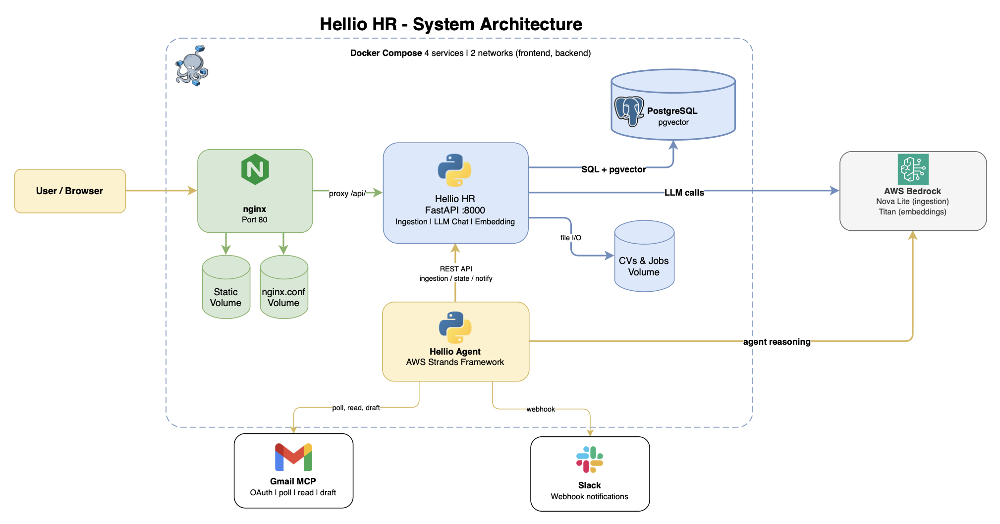
*Docker Compose: nginx, FastAPI, PostgreSQL + pgvector, Strands agent, Gmail MCP, Slack, AWS Bedrock.*

### LLM Operations Overview

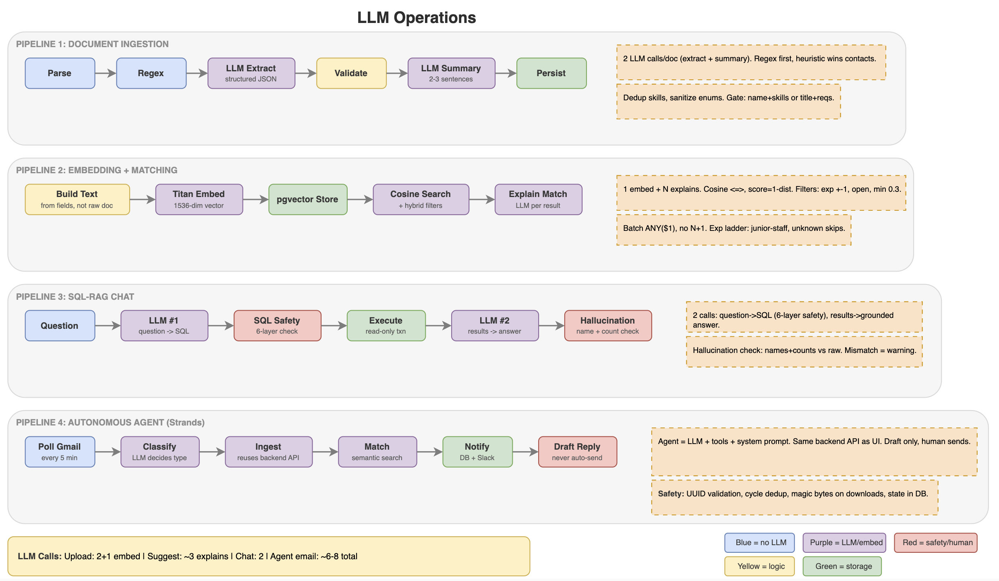
*Four pipelines: ingestion, embedding, SQL-RAG chat, and email agent.*

### Agent Architecture

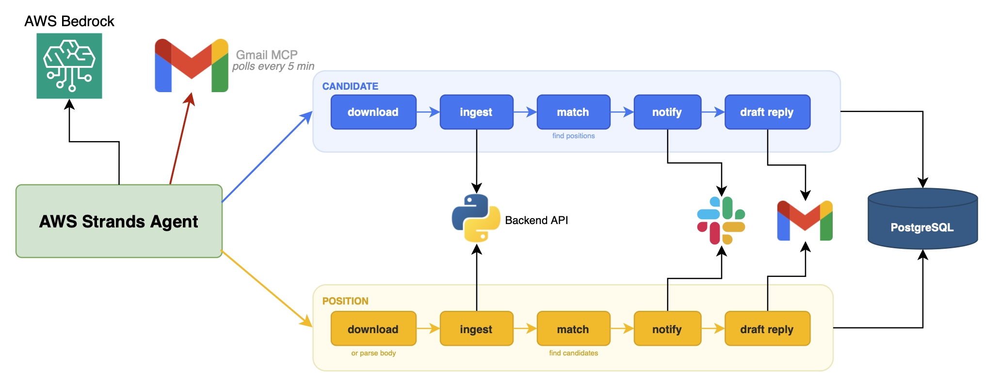
*Strands agent polls Gmail, ingests candidates and positions, drafts replies, notifies via Slack.*

### Document Ingestion Pipeline

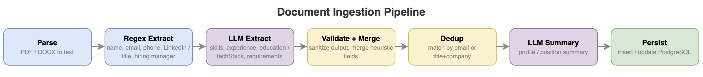
*Shared pipeline for CVs and positions: regex contacts, LLM structured extraction, validate, dedup, summarize, persist.*

### SQL-RAG Chat

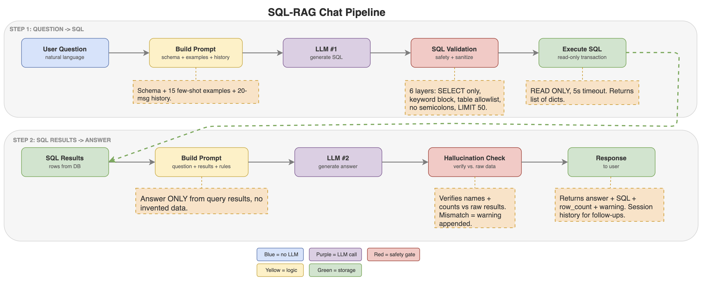
*Two-LLM pipeline with SQL safety checks and hallucination detection.*

### Embedding Architecture

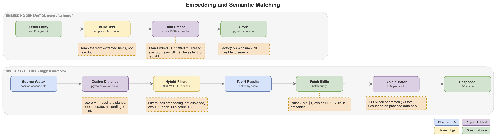
*AWS Titan 1536-dim vectors, cosine distance with hybrid filtering.*

### Database Schema

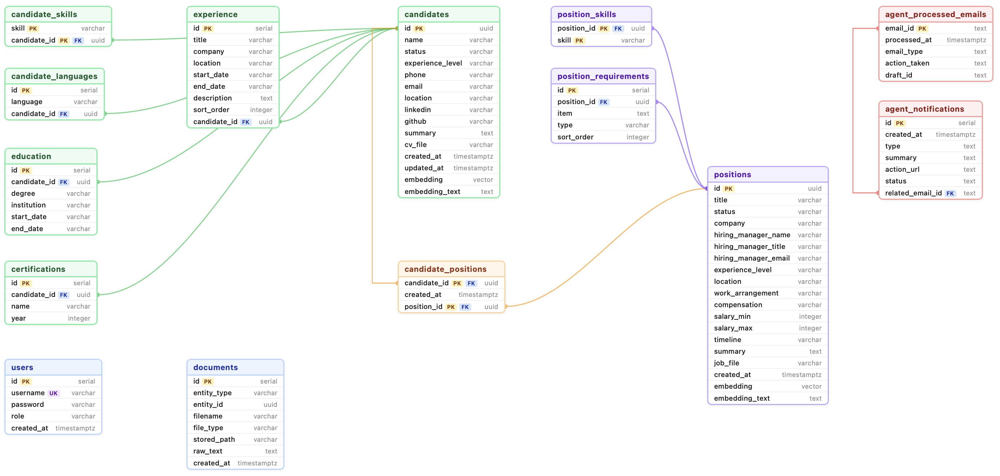
*Relational schema with pgvector embedding columns.*

### Embedding Space

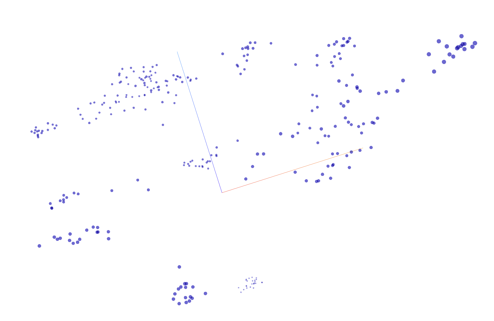
*visualization showing natural clustering by skill profile.*

## Application

<table>
<tr>
<td width="50%">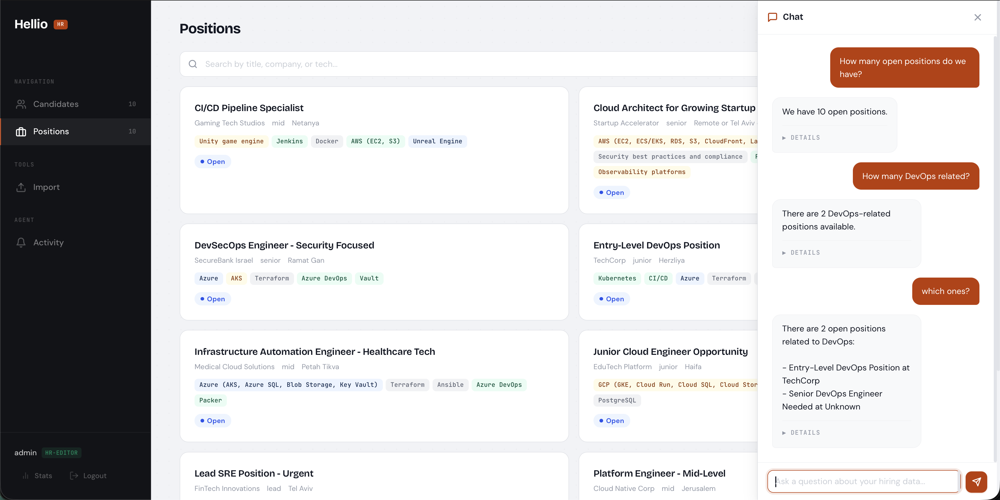<br><b>SQL-RAG Chat</b></td>
<td width="50%">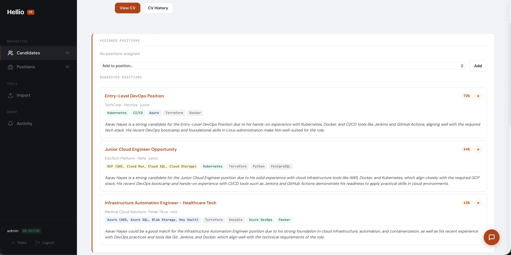<br><b>Semantic Search</b></td>
</tr>
<tr>
<td width="50%">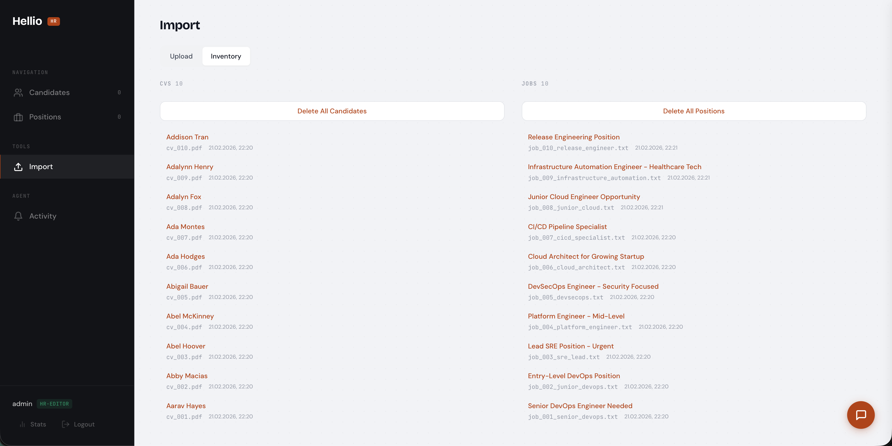<br><b>Document Import</b></td>
<td width="50%">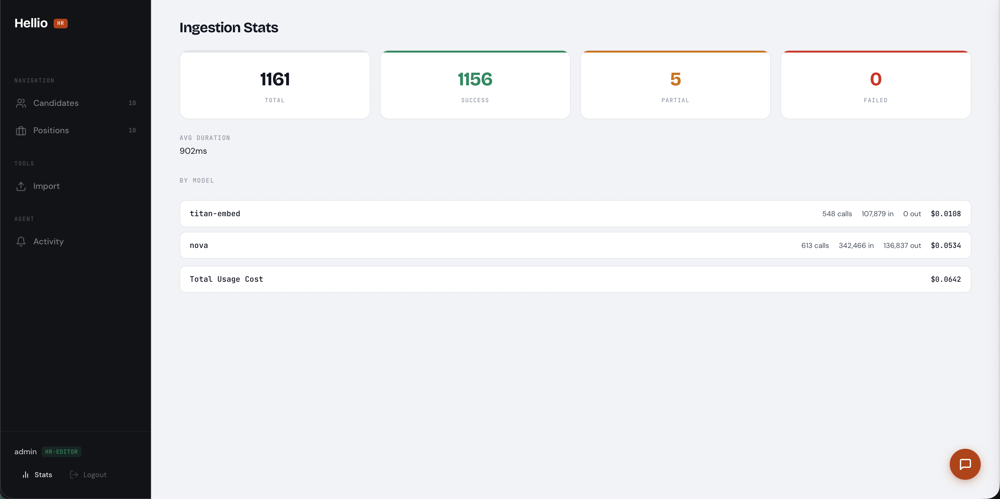<br><b>LLM Cost Tracking</b></td>
</tr>
<tr>
<td width="50%">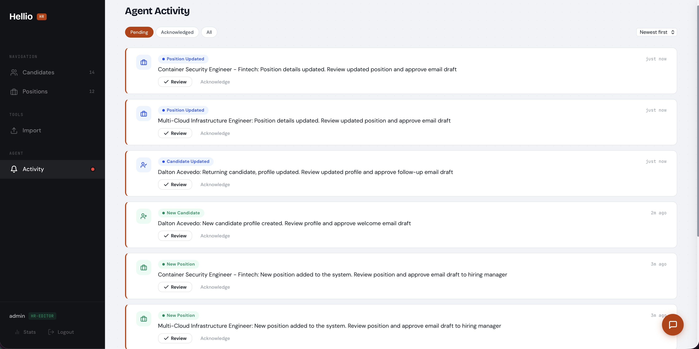<br><b>Agent Activity</b></td>
<td width="50%">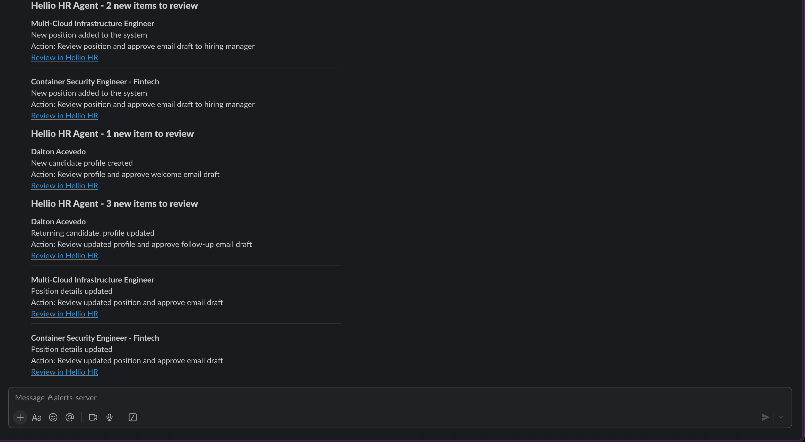<br><b>Slack Alerts</b></td>
</tr>
<tr>
<td colspan="2">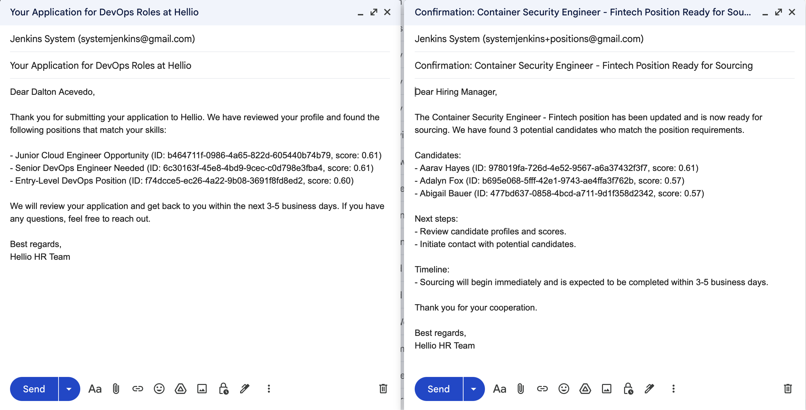<br><b>Gmail Drafts</b></td>
</tr>
</table>

## Tech Stack

| Layer | Technology |
|-------|-----------|
| Frontend | HTML / CSS / JS (ES modules), nginx |
| Backend | FastAPI, asyncpg |
| Database | PostgreSQL 18, pgvector |
| LLM | AWS Nova (generation), AWS Titan (embeddings) |
| Agent | AWS Strands, Gmail MCP |
| Auth | JWT (bcrypt + PyJWT), RBAC (Viewer / Editor) |
| Infrastructure | Docker Compose |
| Testing | Playwright (e2e), pytest (backend) |

## Prerequisites

### Required: `.env` file

Create a `.env` file in the project root:

```env
DB_PASSWORD=your_db_password
JWT_SECRET=your_jwt_secret

# AWS Bedrock (required for ingestion, chat, embeddings)
AWS_REGION=us-east-1
AWS_ACCESS_KEY_ID=your_key
AWS_SECRET_ACCESS_KEY=your_secret
AWS_SESSION_TOKEN=your_token          # optional, for temporary credentials
```

### Required: AWS Bedrock access

The backend calls AWS Bedrock for LLM operations. Your AWS credentials need access to:
- **Amazon Nova Lite** (document ingestion, chat, summarization)
- **Amazon Titan Embed v1** (embedding generation)

### Optional: Agent (Exercise 6)

The autonomous agent requires additional setup:

```env
# Add to .env
GMAIL_TARGET_ADDRESS=your@gmail.com   # inbox to monitor
SLACK_WEBHOOK_URL=https://hooks.slack.com/...  # optional, for notifications
POLL_INTERVAL_SECONDS=300             # default: 5 minutes
```

**Gmail MCP credentials**: Place your Gmail OAuth credentials at `~/.gmail-mcp/` (mounted read-only into the agent container).

## Quick Start

```bash
docker compose up -d --build
```

Open http://localhost. Default credentials: `admin` / `admin`

## Testing

```bash
docker compose exec hellio-hr pytest      # backend
npx playwright test                       # e2e
```

## Project Structure

```
static/          Frontend (HTML/CSS/JS)
backend/         FastAPI API, database, LLM services
agent/           Autonomous HR agent (Strands)
tests/           Playwright e2e specs
CVsJobs/         CV and job description storage
Screenshots/     Architecture diagrams and app screenshots
```
